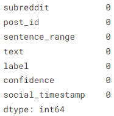
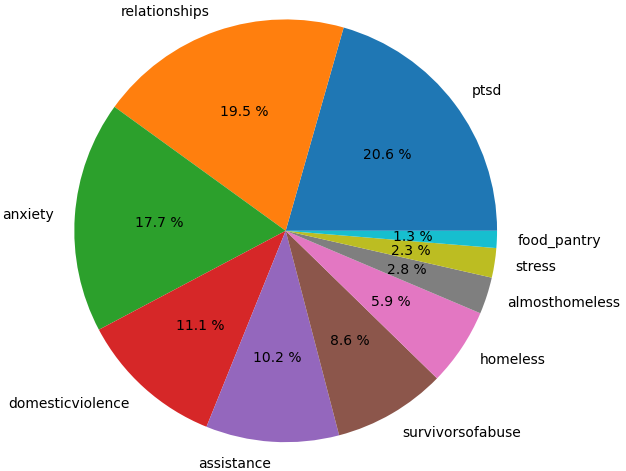
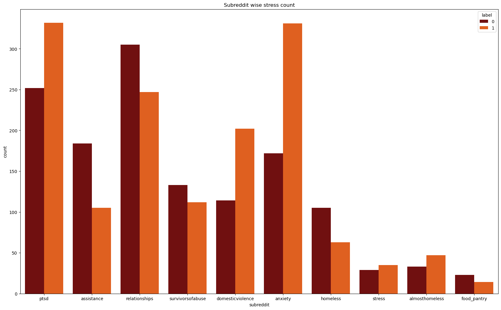
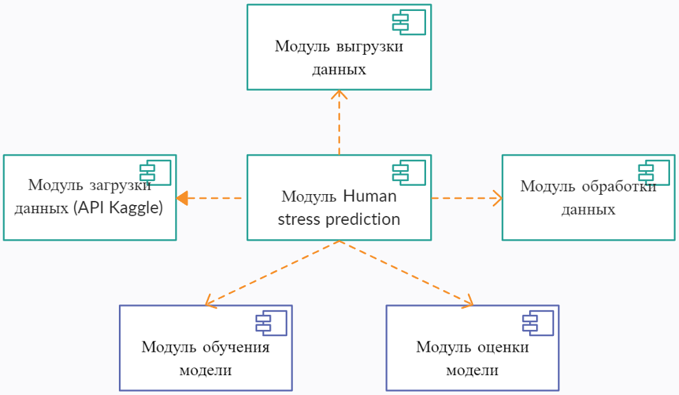
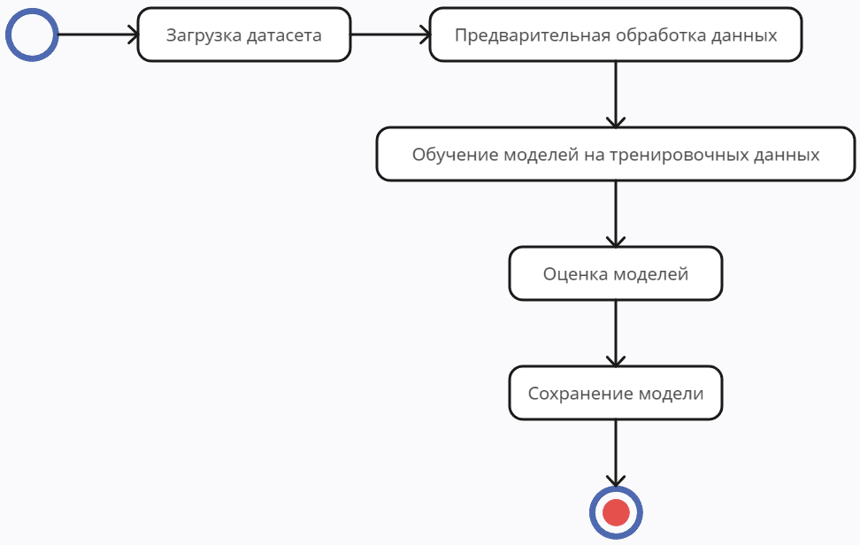

# Human Stress Prediction
____
## Проект: 
[Human Stress Prediction](https://github.com/GALGEN3/human-stress-predict)
____
## Цель:
> Повысить точность обнаружения стрессового состояния человека.
____
## Задачи:
1. - [ ] Анализ существующих решений;
2. - [ ] Сбор данных и их обновление;
3. - [ ] Обучение и оценка моделей на исходном датасете;
4. - [ ] Выбор двух моделей с наибольшим значением точности;
5. - [ ] Оценка качества и скорости работы модели;
6. - [ ] Выбор и развертывание наилучшей модели;
____
## Используемый датасет:
[Kaggle/human-stress-prediction](https://www.kaggle.com/datasets/kreeshrajani/human-stress-prediction)
____
## Целесообразность использования датасета для решения поставленной задачи:
Обнаружение стресса - сложная задача, поскольку существует очень много слов, которые люди могут использовать в своих сообщениях и которые могут показать, испытывает ли человек психологический стресс или нет. Этот набор данных содержит сообщения, размещенные на сабреддитах, связанные с психическим здоровьем в которых люди рассказывают о своей жизни. Данные заранее помечены как 0 и 1, где 0 показывает отсутствие стреса, а 1 - его наличие. В данных отсутствуют пустые строки. 

Анализ стрессового состояния человека может помочь в диагностике заболеваний, связанных со стрессом, и, следовательно, поддержать терапевтические решения по их определению и устранению.
____
## Word cloud

____
## Распределение значений

____
## Диаграммы
+ Component diagram;
+ Activity diagram;
____
### Component diagram
Диаграмма компонентов, описывающая структуру системы:

### Activity diagram
Диаграмма компонентов процесса работы системы:

